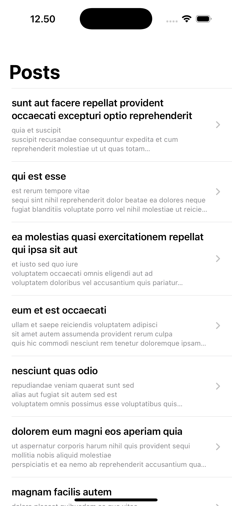

# iOS Posts App

A SwiftUI iOS application that fetches and displays posts from JSONPlaceholder API, built with MVVM architecture, comprehensive state management, and following SOLID principles.

## Features

- 📱 **SwiftUI Interface** - Modern declarative UI
- 🌐 **Network Integration** - Fetches data from JSONPlaceholder API
- 🔄 **State Management** - Custom DataState pattern for loading/success/error/empty states
- 🧪 **Comprehensive Testing** - Unit tests and UI tests included
- 🎨 **Component-Based Architecture** - Reusable UI components following SOLID principles
- ♻️ **Pull-to-Refresh** - Swipe to refresh posts list
- 🚨 **Error Handling** - Graceful error states with retry functionality
- 📊 **Empty State** - Proper handling of empty data scenarios

## Screenshots

### Posts List View


The main posts list displays:
- Clean list interface with post titles and preview text
- Navigation arrows indicating tappable items
- Pull-to-refresh functionality
- Responsive SwiftUI layout

### Post Detail View


The post detail view shows:
- Full post title and content
- Clean typography and spacing
- Back navigation to posts list
- Scrollable content for longer posts

### Additional States
The app also includes these states (not shown in screenshots):
- Loading state with progress indicator
- Error state with retry functionality
- Empty state with refresh option

## Architecture

### MVVM Pattern
- **Model**: `Post` data structure
- **View**: SwiftUI views and components
- **ViewModel**: `PostsViewModel` managing business logic and state

### Component Structure
```
Views/
├── PostsView.swift              # Main coordinator view
├── PostDetailView.swift         # Post detail view
└── Components/
    ├── LoadingStateView.swift   # Loading state component
    ├── ErrorStateView.swift     # Error state component
    ├── EmptyStateView.swift     # Empty state component
    ├── PostRowView.swift        # Individual post row
    └── PostsListView.swift      # Posts list container
```

### SOLID Principles Applied
- **Single Responsibility**: Each component has one clear purpose
- **Open/Closed**: Components are extensible without modification
- **Liskov Substitution**: Components can be easily swapped
- **Interface Segregation**: Clean, focused interfaces
- **Dependency Inversion**: Abstraction-based dependencies

## Technical Stack

- **Language**: Swift 5
- **UI Framework**: SwiftUI
- **Architecture**: MVVM
- **Networking**: URLSession with async/await
- **State Management**: Custom DataState enum
- **Testing**: Swift Testing (unit tests) + XCTest (UI tests)
- **Minimum iOS Version**: iOS 18.5

## Project Structure

```
testing/
├── Models/
│   └── Post.swift                    # Post data model
├── Services/
│   └── PostService.swift             # API service layer
├── ViewModels/
│   └── PostsViewModel.swift          # MVVM ViewModel
├── Views/
│   ├── PostsView.swift               # Main posts view
│   ├── PostDetailView.swift          # Post detail view
│   └── Components/                   # Reusable UI components
├── Utils/
│   └── DataState.swift               # State management enum
├── Assets.xcassets/                  # App assets
├── testingTests/                     # Unit tests
├── testingUITests/                   # UI tests
└── testingApp.swift                  # App entry point
```

## Installation & Setup

1. **Clone the repository**
   ```bash
   git clone <repository-url>
   cd testing
   ```

2. **Open in Xcode**
   ```bash
   open testing.xcodeproj
   ```

3. **Build and run**
   - Select your target device/simulator
   - Press `Cmd + R` to build and run

## Development Commands

### Building
```bash
# Build the project
xcodebuild -project testing.xcodeproj -scheme testing build

# Clean build
xcodebuild clean -project testing.xcodeproj -scheme testing
```

### Testing
```bash
# Run all tests
xcodebuild test -project testing.xcodeproj -scheme testing -destination 'platform=iOS Simulator,name=iPhone 16 Pro'

# Run unit tests only
xcodebuild test -project testing.xcodeproj -scheme testing -destination 'platform=iOS Simulator,name=iPhone 16 Pro' -only-testing:testingTests

# Run UI tests only
xcodebuild test -project testing.xcodeproj -scheme testing -destination 'platform=iOS Simulator,name=iPhone 16 Pro' -only-testing:testingUITests
```

### Code Quality
```bash
# Analyze code for warnings
xcodebuild analyze -project testing.xcodeproj -scheme testing
```

## API Integration

The app integrates with [JSONPlaceholder](https://jsonplaceholder.typicode.com/) API:

- **Endpoint**: `https://jsonplaceholder.typicode.com/posts`
- **Method**: GET
- **Response**: Array of post objects with `id`, `title`, and `body`

### Post Model
```swift
struct Post: Identifiable, Decodable {
    let id: Int
    let title: String
    let body: String
}
```

## State Management

The app uses a custom `DataState` enum for comprehensive state management:

```swift
enum DataState<T> {
    case initiate
    case loading
    case empty
    case failed(error: Error)
    case success(data: T)
}
```

## Testing

### Unit Tests
- **Framework**: Swift Testing
- **Coverage**: API service, data models
- **Location**: `testingTests/testingTests.swift`

### UI Tests
- **Framework**: XCTest
- **Coverage**: Navigation, user interactions, state handling
- **Features Tested**:
  - Posts list loading and display
  - Navigation to detail view
  - Pull-to-refresh functionality
  - Error state recovery
  - Loading state handling
  - Content validation

## Key Features Implementation

### Network Layer
- Modern async/await networking
- Comprehensive error handling
- Protocol-based service abstraction

### UI Components
- Modular, reusable SwiftUI components
- Consistent design patterns
- Accessibility support

### Error Handling
- Network error recovery
- User-friendly error messages
- Retry functionality

### Performance
- Efficient list rendering
- Proper memory management
- Launch performance optimization

## Contributing

1. Fork the repository
2. Create a feature branch
3. Follow the existing code style and architecture
4. Add tests for new functionality
5. Ensure all tests pass
6. Create a pull request

## Requirements

- Xcode 16.0+
- iOS 18.5+
- Swift 5.0+

## License

This project is created for educational and demonstration purposes.

## Technical Test Implementation

This project fulfills the following technical test requirements:

✅ **SwiftUI Implementation**: Modern declarative UI  
✅ **API Integration**: JSONPlaceholder posts endpoint  
✅ **Data Mapping**: Proper Post model structure  
✅ **Navigation**: List to detail view navigation  
✅ **State Management**: Loading, error, and success states  
✅ **Clean Architecture**: MVVM with SOLID principles  
✅ **Async/Await**: Modern networking approach  
✅ **Error Handling**: Comprehensive error management  
✅ **Responsive UI**: SwiftUI best practices  
✅ **Clean Code**: Well-structured and readable  
✅ **Unit Tests**: API service testing  

The implementation demonstrates professional iOS development practices with a focus on maintainability, testability, and user experience.